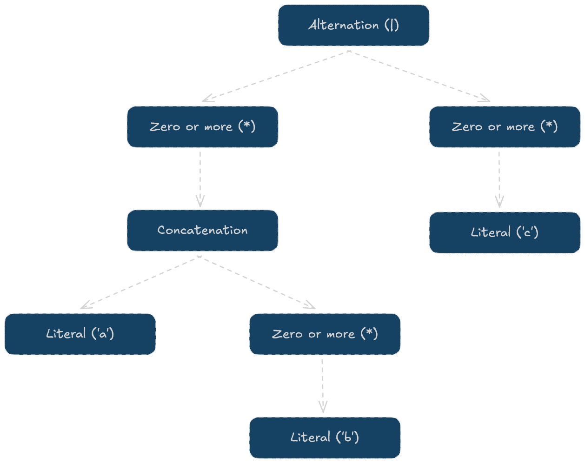

# Build-your-own-regex
https://en.wikipedia.org/wiki/Regular_expression

https://en.wikipedia.org/wiki/Finite-state_machine

https://en.wikipedia.org/wiki/Deterministic_finite_automaton

This regex engine performs the following steps:

Lexer → Abstract syntax tree → Thompson construction

## Lexer
A [**lexer**](https://en.wikipedia.org/wiki/Lexical_analysis) converts an input string into a set of tokens. The lexer 
in this project is very simple, every character is treated as a token. The only exception is when we encounter a `[`, 
in which we group all characters until find the closing bracket `]`.

`a*|[a-z]` → `['a', '*', '|', '[a-z]']`

## Abstract syntax tree
[**Abstract syntax tree**](https://en.wikipedia.org/wiki/Abstract_syntax_tree)'s are used to represents the structure of a program. We'll use this to represent the order of 
operations that the regex will perform.

### Recursive descent parser
https://en.wikipedia.org/wiki/Recursive_descent_parser

The regex `(ab*)*|c*` converts into the following AST:

## Thompson construction
[**Thompson's construction**](https://en.wikipedia.org/wiki/Thompson%27s_construction) is a method of transforming a 
regular expression into an equivalent nondeterministic finite automaton (NFA). We recursively navigate down the AST tree
and tackle each node. Each node is identified and converted into a subexpression. By working our way up the tree and 
merging each subexpression, we end up with our complete NFA.

## Backtracking
https://en.wikipedia.org/wiki/Regular_expression#Implementations_and_running_times

https://en.wikipedia.org/wiki/Backtracking

## Features
| Type            | Symbol  | Description                                               | Example                                                         |
|-----------------|---------|-----------------------------------------------------------|-----------------------------------------------------------------|
| Literal         | `a`     | Matches the exact character                               | `cat` matches "cat"                                             |
| Alternation     | `a\|b`  | Matches either the left or right                          | `cat\|dog` matches "cat" or "dog"                               |
| Concatenation   | `ab`    | Matches expressions in sequence                           | `ca` matches "ca" in "cat"                                      |
| Zero or More    | `a*`    | Matches zero or more repetitions of the preceding element | `ba*` matches "b", "ba", "baa", etc.                            |
| Zero or One     | `a?`    | Matches zero or one occurrence of the preceding element   | `colou?r` matches "color" or "colour"                           |
| One or More     | `a+`    | Matches one or more repetitions of the preceding element  | `ba+` matches "ba", "baa", but not "b"                          |
| Wildcard        | `.`     | Matches any single character                              | `c.t` matches "cat", "cot", "c9t", etc.                         |
| Character Range | `[a-z]` | Matches any character within the specified range          | `[0-9]` matches any digit, `[a-z]` matches any lowercase letter |

## Challenges
- Memory management with `unique_ptr` 
  - Revisit: https://www.studyplan.dev/intro-to-programming/memory-ownership
- usages of `const` on return values
  - Revisit: https://www.studyplan.dev/intro-to-programming/const
- Recursive descent parser
  - Exercise: Create a mathematical expression parser

## TODOS
- [ ] Benchmark against standard library regex